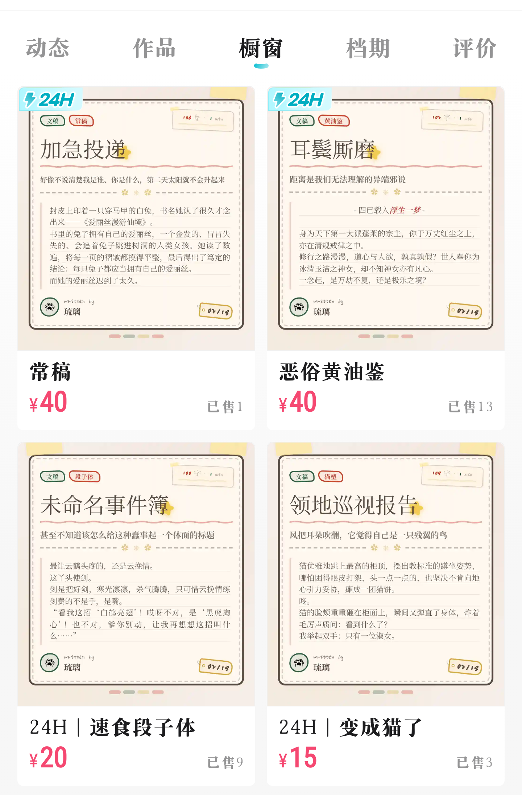

# 
更适合文手体质的简易排版APP

# 内置一款颇为漂亮的文本排版
**天下文手苦排版久矣！**

# 使用须知
* 本项目由ChatGPT-Codex（gpt-5.3-codex）、Gemini-Antigravity（claude-opus-4-6-thinking＆gemini-3-pro-preview）轮流上阵编写，代码含人量几乎为0，如果包含重大失误请友善地提醒！史山代码是正常的，一堆bug也是正常的，如果有错误可通过issue或小红书反馈，**不包修**。
* **如果您不支持AI代码，请不要使用本项目。**
* 请不要将通过本项目制作的图**片用于任何商业领域**，二改代码也不可以，因为我是个很小气的人我都没赚到几个钱。

## 常见问题（Q&A）
* 1. 啊，那我想用来当接稿例图可以吗？ 可以。
* 2. 那什么才算商用？ 您不能以“代排版”或其他理由向任何人收取费用，却向其提供本项目的使用教程或本项目输出的PNG图片。

* 本项目不遵循CC BY-NC-SA 4.0或其他可能的任何协议，一切最终解释权归属作者

# 3种排版模式
## 橱窗封面
更适配画加橱窗，但可输入的文本较少。
橱窗商品卡片大小的设置为：固定比例。

	
	
效果图展示

## 小红书封面
更适合小红书封面，输入的文本较多。

	
骗你的，没截图

	
效果图展示

## 长文
可以用于排版长文本。自测5k左右一切正常。

# 支持简单的富文本编辑
* 加粗、斜体、下划线或对齐方式修改
* 字体颜色修改
* 字号修改（请暂时不要单独调整某部分文字的字号，会出现显示Bug，此人没修好）

# 多种使用方式
* 对于iOS、鸿蒙或其他可能无法使用APP的用户，可通过[网页版](https://xianshuyouzhi.pages.dev/)使用。
* 对于想尝试APP的用户，请将more-action 中自行下载 APK 文件。

# 请我喝杯奶茶
[请我喝杯奶茶](https://afdian.com/a/liulibxxw)

**本项目是开源的。如果你将APK安装到移动设备，作者不对可能造成的任何损失负责任**
